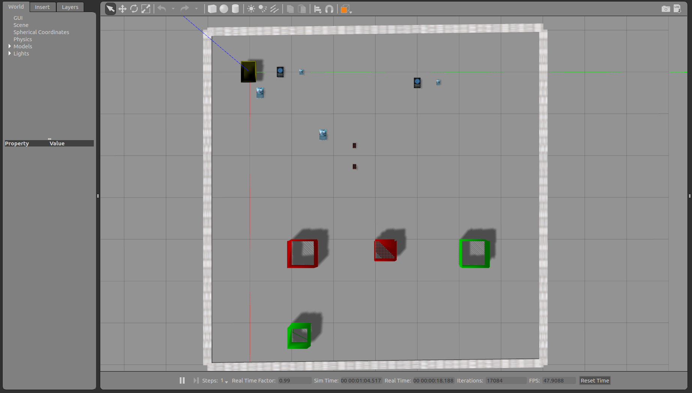

Homework 2 - Programming Section
==================================

Welcome to Programming section of Homework 2 for CSE 471 - Fall 2020.

This section will test your understanding of Planning as covered in the class.

==================
Plagiarism Warning
==================
Powerful copy-detection systems will be used as part of grading, so please **DO NOT** submit/use any piece of code that is not **your own** work. These systems can easily catch instances where users change variable names, etc. from copied code.

If you use any helper code, do not forget to cite it using comments inside the code.

If you are stuck at any point, you can approach the professor or TA for help.

As mentioned in class, please remember the academic integrity policy of this course.

.. figure:: ./images/plagiarism.png
    :scale: 50 %
    :alt: Academic Integrity Policy

=================
Tasks
=================

#. [30 points] Complete the domain.pddl by completing the pick and move actions.

#. [30 points] Complete the problem.pddl by writing the correct problem independent goal.

=================
Extra Credit
=================

#. [5 points] Send a video of Gazebo executing the task successfully. The robot must pick and place at least 4 books.

#. [10 points] Improve the quality of the high-level plans and refinements by  utilizing a different high-level planner (FF/different mode of FD) as well as changing the low-level search algorithm. You will be eligible for extra credit if the refinement is correct and the # of actions performed by the robot (in the low-level plan) is less than the solution that we have on file using the default configuration of the high-level planner and low-level search that is provided to you.
    
#. [10 points] Use universal and existential quantifiers to write the goal formula.

Please refer to `instructions section <#instructions>`_ to understand what these tasks mean and how to setup the environment. It also includes a number of tips that will significantly simplify your task. Follow the instructions strictly to ensure that your assignment can be graded by the auto-grader. **Custom grading requests will not be entertained**.

=============================
Grading Policy
=============================

#. A submission is considered late the moment the deadline has elapsed.
#. We will deduct 3% of your grade for every hour submitted late upto a maximum 24 hours.
#. No points will be given if the assignment is submitted later than 24 hours.
#. In order to get full points for Task 1, your goal should be independent of the number of objects in the environment.
#. In order to get full points for Task 2, all the action descriptions should be correct. No partial points will be awarded if not all actions are right.
#. Your final submitted code should run without any input or configuration from the graders. If any changes are required to get your submitted code to run, points will be deducted in a manner proportional to the number of changes needed. If you follow the instructions your code will run without any inputs from the graders.
#. Homework will be graded on Ubuntu 18.04 machines setup with ROS Melodic, and Python 2.7. Use the setup from HW0 to ensure your code runs as intended with this configuration.

Instructions
=================

===============================
Setting up the **hw2** Folder
===============================
We assume that you have completed the setup as instructed in Homework 0 and have
downloaded and unzipped the file to the ~/catkin_ws/src folder.

#. Change permission of all scripts in the hw2 folder to make them executable.

    .. code-block:: bash

       chmod u+x ~/catkin_ws/src/hw2/scripts/*.py

#. Execute the env_setup.sh script. It will copy the necessaty files in respective folders. This script will fail if you don't have turtlebot folder in ~/catkin_ws/src. Refer Homework 0 setup if this is the case.

    .. code-block:: bash

       chmod u+x ~/catkin_ws/src/hw2/env_setup.sh && ~/catkin_ws/src/hw2/env_setup.sh

=============================
Environment Setting
=============================

Refer the image below to see how a sample maze environment looks like. The turtleBot has a basket on top of it. There are books of 2 different sizes (large and small) and 2 different subjects lying around on the maze. There are 4 destination bins, 2 of each subject. Each subject has bins of 2 sizes, large and small. Each book has a designated bin, depending on its size and subject.

Some of the terms that we use throughout the assignment are:

#. Book and Bin Size: There are two sizes for the books and bins. Large and Small.

#. Number of Subjects: This is the number of distinct subjects. This number can vary between 1 and 3 inclusive. For each of the subject, two different bins will be generated; large and small. 

#. Number of Books: This is the number of books you have of each subject in each size. This number can vary between 1 and 3 inclusive. So actual number of books in the whole environment is number of books * number of subjects * 2.

#. Load Location: Every book and bin has 2 load locations. For a book it is the set of locations from where it can be picked by the TurtleBot. For a bin it is the set of locations from where the TurtleBot can place the books into this bin.

.. warning::
    We gave multiple load locations because it is possible that one of the book's load location is obstructed by another book. Same can also happen for a bin. In such a case the TurtleBot can go to the another load location and perform the pick or place operation so that it can clear the path.

    **It is possible that both the load locations of a book or bin are obstructed.** In such a case no solution exists, and you have to regenerate a new problem. Reducing the # of books avoids this problem.

#. Grid Size: Grid Size is not used explicitly in this homework. It is dependent on the number of books. For this homework, Grid Size = 6 * number of subjects.

    .. note ::

        In contrast to the previous homework, the actual grid size used for navigation is the same as what is seen in the Gazebo environment. 

        .. list-table::
            :header-rows: 0

            * - .. figure:: ./images/grid.png

                  Fig 1. Grid visible in Gazebo

        Hence, if you have to go from point A to B in Gazebo environment using 'MoveF' action, you will have to give 'MoveF' command only once.

==================================
Completing domain.pddl
==================================

The domain.pddl file provided to you (located at ~/catkin_ws/src/hw2/) looks like this:

.. code-block:: bash

    (define (domain bookWorld)

        (:requirements :equality :typing :strips)

        (:types robot book bin location subject size)

        (:predicates
            (Book_At ?a - book ?b - location)
            (Bin_At ?a - bin ?b - location)
            (Book_Subject ?a - book ?b - subject)
            (Book_Size ?a - book ?b - size)
            (Bin_Subject ?a - bin ?b - subject)
            (Bin_Size ?a - bin ?b - size)
            (Robot_At ?a - robot ?b - location)
            (Empty_Basket ?a - robot)
            (In_Basket ?b - book)
        )

        ; Pick up a book from the location.
        (:action pick
            :parameters (?book - book ?bot - robot ?locbk - location)
            :precondition (and 
                    ; ADD ALL PRECONDITIONS HERE
                )
            :effect (and
                    ; ADD ALL EFFECTS HERE
                )
        )

        ; Place the book on the robot into the bin.
        ; The robot must be at the drop-off location, must be holding the book, and
        ; the book subject and size must match that of the book.
        (:action place
            :parameters (?book - book ?bot - robot ?locbt - location ?bin - bin ?locbn - location ?sizebn - size ?subbn - subject)
            :precondition (and
                (Robot_At ?bot ?locbn)
                (not (Empty_Basket ?bot))
                
                (Book_Size ?book ?sizebn)
                (In_Basket ?book)
                (Book_Subject ?book ?subbn)
                
                (Bin_Size ?bin ?sizebn)
                (Bin_At ?bin ?locbn)
                (Bin_Subject ?bin ?subbn)
            )
            :effect (and
                (Robot_At ?bot ?locbn)
                (Empty_Basket ?bot)
                (not (In_Basket ?book))
                
                (Book_Size ?book ?sizebn)
                (Book_At ?book ?locbn)
                (Book_Subject ?book ?subbn)
                
                (Bin_Size ?bin ?sizebn)
                (Bin_At ?bin ?locbn)
                (Bin_Subject ?bin ?subbn)
            )
        )
        
        ; Move the robot from one location to another.
        (:action move
            :parameters (?bot - robot ?oldloc - location ?newloc - location)
            :precondition (and 
                ; ADD ALL PRECONDITIONS HERE
            )
            :effect (and
                ; ADD ALL EFFECTS HERE
            )
        )
    )

***********
Predicates
***********

    .. list-table::
        :header-rows: 1

        * - **Predicate**
          - Is true if
        * - **(Book_At ?a - book ?b - location)**
          - book ?a is at location ?b
        * - **(Bin_At ?a - bin ?b - location)**
          - bin ?a is at location ?b
        * - **(Book_Subject ?a - book ?b - subject)**: 
          - subject of the book ?a is ?b
        * - **(Book_Size ?a - book ?b - size)**: 
          - size of the book ?a is ?b
        * - **(Bin_Subject ?a - bin ?b - subject)**: 
          - bin ?a stores books of subject ?b
        * - **(Bin_Size ?a - bin ?b - size)**: 
          - bin ?a stores books of size ?b
        * - **(Robot_At ?a - robot ?b - location)**: 
          - robot ?a is at location ?b
        * - **(Empty_Basket ?a - robot)**: 
          - the basket on top of ?a is empty
        * - **(In_Basket ?b - book)**: 
          - the book ?b is in the basket

***********
Actions
***********
#. **Pick**: This action picks the book from floor and puts it in the basket on the Turtlebot3. The capacity of the basket is only 1 book.
#. **Place**: This action places the book in the bin from the basket on the Turtlebot3.
#. **Move**: This action is used to change the location of the Turtlebot3.

Your task is to complete the pick and move actions using the predicates above.
We have already filled in the list of parameters needed.
Think intuitively using the given parameters and determine what the preconditions will be and what the effects are using the action descriptions above.

==================================
Completing problem.pddl
==================================

#. Generate a new problem.pddl file by executing

    .. code-block:: bash

        rosrun hw2 refinement.py --subjects <subjects> --books <books> --seed <seed> --generate-only
        
#. A new problem.pddl file will be created at ~/catkin_ws/src/hw2. This file will not have any goal condition.

#. The problem.pddl the high-level problem, the low-level is also created for you to view in Gazebo.

    .. code-block:: bash

        Terminal 1: roscore
        Terminal 2: roslaunch hw2 maze.launch
        
#. Use ~/catkin_ws/src/hw2/hw2_kill.sh to cleanup the environment (like exiting Gazebo etc).
#. The file contains an incomplete code section that you need to fill with the goal.
#. For your task, you will use refinement.py to generate a new problem.pddl file for which the initial state and objects are already filled in.
#. You will be required to write a generic goal condition for any invocation of refinement.py
#. Open hw2_task.py located at ~/catkin_ws/src/hw2/scripts/ and complete the get_goal_string() method.

#. Write your code so that it produces a goal condition that places all books in the corresponding bin (trolley). For example, if the book B is of subject A, and its size is L, your goal condition must be written so that B is placed in a bin T whose subject is A and size is L.

    .. note:: 
        **Hint for extra credit**: The goal should be that for all the books, there should be a bin with the same subject and size such that the location of book and respective bin is same.

#. You can print the parameters to see how changing the subjects, books in refinement.py will change the problem file generated.

    .. note:: 
        Your code must generate valid PDDL! Check out the Tips section below for some useful resources on PDDL. Also, review the PDDL tutorial again which can help prepare you for this task.

#. A sample goal condition that moves the robot to any random location is provided in hw2_task.py which can give you an idea on how to proceed with the task.
#. This stock goal condition depends on a correct domain.pddl written and can be refined and verified in Gazebo without requiring the pick action to be implemented.

===================================
Checking correctness of pddl files
===================================

We have provided a couple planners for you to use. These are located at ~/catkin_ws/src/hw2/planners/

You can use Fast Downward (FD) to verify if your PDDL files correct.
Once you have completed the domain.pddl and problem.pddl you can use a
high-level planner to verify that a high level plan can be found.

**************
Fast Downward
**************

#. Run FD. Ensure that you have updated goal in problem.pddl before this command.

    .. code-block:: bash
    
        ./planners/FD/fast-downward.py domain.pddl problem.pddl --search "lazy_greedy([ff()], preferred=[ff()])"

#. You can change the parameters given to FD. For its usage simply run fast-downward.py without any parameters. To get complete list of parameters pass -h as an argument.

    .. code-block:: bash
    
        $ ./planners/FD/fast-downward.py 
        usage: fast-downward.py [-h] [--show-aliases] [--run-all] [--translate]
                                [--search]
                                [--translate-time-limit TRANSLATE_TIME_LIMIT]
                                [--translate-memory-limit TRANSLATE_MEMORY_LIMIT]
                                [--search-time-limit SEARCH_TIME_LIMIT]
                                [--search-memory-limit SEARCH_MEMORY_LIMIT]
                                [--validate-time-limit VALIDATE_TIME_LIMIT]
                                [--validate-memory-limit VALIDATE_MEMORY_LIMIT]
                                [--overall-time-limit OVERALL_TIME_LIMIT]
                                [--overall-memory-limit OVERALL_MEMORY_LIMIT]
                                [--alias ALIAS] [--build BUILD] [--debug] [--validate]
                                [--log-level {debug,info,warning}] [--plan-file FILE]
                                [--sas-file FILE] [--keep-sas-file] [--portfolio FILE]
                                [--portfolio-bound VALUE] [--portfolio-single-plan]
                                [--cleanup]
                                INPUT_FILE1 [INPUT_FILE2] [COMPONENT_OPTION ...]
        fast-downward.py: error: translator needs one or two input files
        
#. If you do not get the help output above you might have an incorrect system configuration.

#. If your domain and problem files are **syntactically correct**, you will get a plan that can be easily viewed in the terminal.
#. Also, a correct domain and goal will lead to a correct refinement and the robot will successfully pick and place all books in Gazebo.

=============================
Generating Refinements
=============================

#. This step runs refinement.py without --generate-only and actually produces refinements that can be executed in Gazebo.
#. Run rosrun hw2 refinement.py -h to get basic help.

    .. code-block:: bash

        $ rosrun hw2 refinement.py -h
        usage: refinement.py [-h] [--subjects SUBJECTS] [--books BOOKS] [--seed SEED]
                             [--file-name FILE_NAME] [--clean]
        optional arguments:
          -h, --help            show this help message and exit
          --subjects SUBJECTS   No of book subjects.
          --books BOOKS         The number of books in the grid.
          --seed SEED           The random seed
          --file-name FILE_NAME
                                Store results in <file> in the project root directory.
          --clean               Cleanup the existing csv files

#. In a terminal, run the following:

    .. code-block:: bash

        rosrun hw2 refinement.py --subjects <subjects> --books <books> --seed <seed>

    Provided that your domain.pddl and hw2_task.py are implemented correctly, this will run
    successfully without errors. If not, an exception msg will be printed to the
    screen.

#. You can view the high-level planner log found at ~/catkin_ws/src/hw2/planner_output.log to see the result of the high-level planner.
#. Also, the results of your latest run can be found as the last line of ~/catkin_ws/src/hw2/results.csv
#. Running rosrun hw2 refinement.py with --clean will clear the results.csv file or you can simply delete it.

=============================
Running Gazebo
=============================

#. Assuming you have a successful execution of refinement.py, a log of the environment
and the refinement is created in ~/catkin_ws/src/hw2/results.csv

#. The latest run is always the last line of the file.

#. If you want to run the latest run of refinement.py, execute the following command.

    .. code-block:: bash

        rosrun hw2 gazebo.py --input-file ~/catkin_ws/src/hw2/results.csv

#. Alternatively, if you want to run specific run on Gazebo execute the following comamnd.

    .. code-block:: bash

        rosrun hw2 gazebo.py --input-file ~/catkin_ws/src/hw2/results.csv --line <line>
        
    .. note:: 

        If your domain.pddl and problem.pddl are not written correctly, you might see
        incorrect execution on Gazebo!

=============================
Submission Instructions
=============================
#. Please run ~/catkin_ws/src/hw2/submit.sh to that will generate a submit.csv file in ~/catkin_ws/src/hw2/
#. Make sure that the file is present! If submit.sh has problems there will be some output printed to the terminal screen, else it will be blank.
#. Zip up the hw2 directory (7z a <asurite_ASU#>.zip ~/catkin_ws/src/hw2). An example name is jdoe_120444222.zip
#. Submit to Gradescope.

=============================
Testing the refinements
=============================
We will be grading your changes based on whether they generate correct refinements or not.

#. Run ~/catkin_ws/src/hw2/test_cases.sh to generate ~/catkin_ws/src/hw2/src/test_cases.csv
#. Submit this file to gradescope using the submission instructions and it will auto-grade it for you.
#. The auto-grader will also check your code for the extra-credit section.
#. Finally, you can also submit any new test cases by modifying the same file, however, our auto-grader will only provide feedback on up to 10 test cases. You can resubmit with others if you wish.
#. We will be keeping the testcase feedback locked until a certain time has elapsed. We will make an announcement once it is available.
#. You can use the stock goal task to inspect how refinements generated in .csv look like once you implement the correct move action template.

=============================
Tips and Suggestions
=============================

#. White space, incorrect parentheses are common problems when writing PDDL. The high-level planner can be used to quickly verify if your PDDL is valid or not. It will usually give a descriptive error message of what went wrong while parsing the PDDL.
#. Review the PDDL tutorials and other resources for learning how to write PDDL.
#. Test your implementation with smaller number of books and smaller number of subjects to see if it works as expected. On a Gazebo execution, the robot must pick up all books and place them in bins. Which bins are correct is a bit harder to check in Gazebo however a general indicator is it dropping books in different bins. Your action preconditions must ensure this!
#. If refinement of the move action fails, check visually on Gazebo if actually there is no refinement possible. This can provide hints as to whether your domain and problem are incorrectly written since the world generated is independent of the domain and problem file. You can always run gazebo.py after refinement.py to open a world view of the last problem generated.
#. Use ~/catkin_ws/src/hw2/hw2_kill.sh to kill everything related to hw2 and start afresh if your terminals get stuck etc.
#. At times, the TurtleBot takes some time to perform an action, so wait for some time if no movement is visible.
#. Not all problems have valid refinements, this is because the robot can only carry one book in the basket at a time.
#. Even if refinement.py fails to generate any plan, it still writes the world to results.csv, you can run Gazebo to just view the world and get a visual idea of what the world looks like, but note that it will exit relatively quickly, so you can manually open Gazebo by typing roscore in one terminal and roslaunch hw2 maze.launch in another terminal.
#. --generate-only also creates the world that can be easily viewed in Gazebo by using the instructions in the point above.
#. You might need to recompile the FF planner provided if it does not execute on your system.
#. Gazebo takes a bit long when loading the environment for the first time. So if you see a black screen do not worry!
#. Check the discussion page on Canvas to see if the problem you are facing is already answered. If not, start a new discussion.

************************************
Resources
************************************

#. A simple place to start would be `PDDL Version 1.2 Manual <https://www.dewilkins.org/papers/pddl.pdf>`_.

#. If you are looking for an exhaustive resource, you can refer `An Introduction to the PDDL <https://www.morganclaypool.com/doi/abs/10.2200/S00900ED2V01Y201902AIM042>`_. This book is available on ASU's Library.

#. A collection of PDDL Domains and Problems is available on `this Github Repository <https://github.com/potassco/pddl-instances>`_. You can use these domains and problems to familiarize yourself with how the high-level planners work.
#. FastDownward homepage: http://www.fast-downward.org/
#. FF planner is located at ~/catkin_ws/src/hw2/planners/

API
=============================

This API only lists the part of code that you will have to use to complete this Homework and Extra Credit. 
You are free to explore the code by looking into each file separately, but do not change anything other than hw2_task.py, test_cases.sh, ,planner.py, domain.pddl, and problem.pddl.

As a part of this assignment, you will only need to modify:

#. hw2_task.py
#. domain.pddl
#. problem.pddl

You may also need to modify the following:

#. planner.py

Below is a list of some other utility files:

#. submit.sh: Used to generate the submit.csv that you need for submitting this homework.
#. test_cases.sh: Used to generate test_cases.csv that you can submit to gradescope for validating your solution. You can include your own test cases here (ie. modify this one).
#. hw2_kill.sh: Used to clean up the environment. Use this first if you face problems and errors.
#. planner_output.log: View the results of the high-level planner after running refinement.py

Browse through the source code of the files above to get a better idea of the
expectations.
